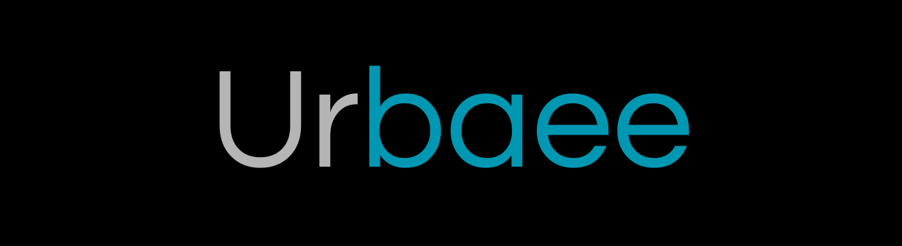

# 💫 About Me:
Yo! I'm Rahmat 👨‍💻  A passionate Informatics Engineering student with a curious mind and a thing for all things **AI**, **Machine Learning**, **Multimedia**, and **UI/UX Design**.   I'm on a journey to blend smart systems with beautiful interfaces — because great tech should look good *and* think smart 🤖✨  Currently exploring how machines learn, how humans interact with them, and how to make that experience as smooth (and fun) as possible.

## 🌐 Socials:
   

# 💻 Tech Stack:
                            
# 📊 GitHub Stats:
 
 

### ✍️ Random Dev Quote

---

<!-- Proudly created with GPRM ( https://gprm.itsvg.in ) -->
